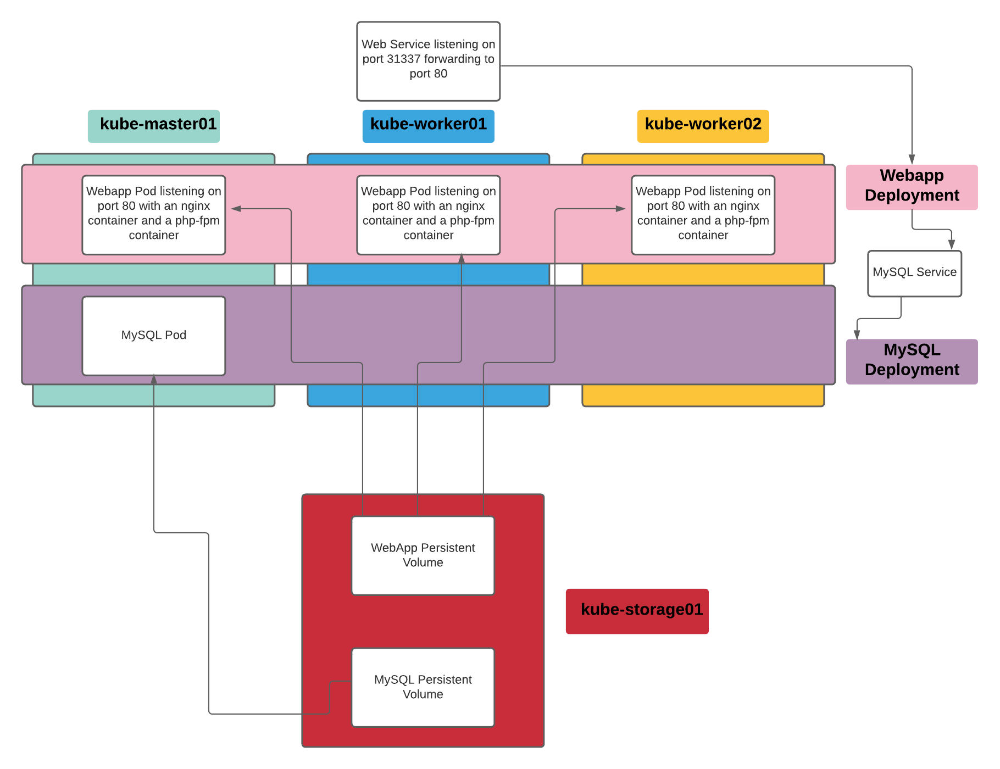

# Redundant Pod Application
  
Here we will be deploying a similar solution to the [Single Pod Application](../Labs/single.md) but the Pod that contains both the NGINX and PHP-FPM applications will reside in the same Pod as separate Containers and will be replicated to have a total of 3 copies running.
  
**Here is a Diagram:**

  
**Create the `apps/redundant_pod` directory:**
```
mkdir -p ~/apps/redundant_pod
```

**There is a little more going on with this deployment which means more yaml files.**
**These yaml files exist premade and can be downloaded from here:**  
[01-web-service.yaml](./Yaml_Files/01-web-service.yaml)  
[02-wordpress-config.yaml](./Yaml_Files/02-wordpress-config.yaml)  
[03-wordpress-pvc.yaml](./Yaml_Files/03-wordpress-pvc.yaml)  
[04-wordpress-creds.yaml](./Yaml_Files/04-wordpress-creds.yaml)  
[05-code-pull.yaml](./Yaml_Files/05-code-pull.yaml)  
[06-mysql-pvc.yaml](./Yaml_Files/06-mysql-pvc.yaml)  
[07-mysql-cred.yaml](./Yaml_Files/07-mysql-cred.yaml)  
[08-mysql-deployment.yaml](./Yaml_Files/08-mysql-deployment.yaml)  
[09-nginx-config.yaml](./Yaml_Files/09-nginx-config.yaml)  
[10-webapp-wordpress.yaml](./Yaml_Files/10-webapp-wordpress.yaml)  
  
**Place all these yaml files in `apps/redundant_pod/`**
  
**On a high level, this is what each file does:**
`01-web-service.yaml`
```
Creates the service named web-service
Ties the service to the 'webapp' application
Sets the listening port on the nodes to 31337 and sends that traffic to port 80 on the Pods 
```
  
`02-wordpress-config.yaml`
```
Creates a configMap containing the wp-config.php contents
The 'DB_NAME', 'DB_USER', 'DB_PASSWORD', and 'DB_HOST' variables will be pulled from secrets
```
  
`03-wordpress-pvc.yaml`
```
This will create a Persistent Volume Claim and a 5GB Read Write Many Persistent Volume on the NFS backed storage to be used for the wordpress data
```
  
`04-wordpress-creds.yaml`
```
This will create a secret containing the 'DB_NAME', 'DB_USER', 'DB_PASSWORD', and 'DB_HOST' (in encoded base64)
```
  
`05-code-pull.yaml`
```
This creates a minimal container in a pod that,
mounts the wordpress-data persistent volume at /code
mounts the wp-config.php config map at /config/wp-config.php
git clones this repo to obtain the wordpress code
moves the code and the wp-config.php into the /code directory and replaces the 'DB_NAME', 'DB_USER', 'DB_PASSWORD', and 'DB_HOST' variables
after this process is complete the pod will go into a complete state
```
  
`06-mysql-pvc.yaml`
```
This will create a Persistent Volume Claim and a 5GB Read Write Many Persistent Volume on the NFS backed storage to be used for the mysql data
```
  
`07-mysql-cred.yaml`
```
This will create a secret containing the mysql credentials (in encoded base64)
```
  
`08-mysql-deployment.yaml`
```
This creates the service named mysql and ties it to the 'mysql' application
Creates a deployment with a single pod that will.
mount the mysql Persistent Volume at /var/lib/mysql/
set the mysql credentials from the mysql-cred secret
```
  
`09-nginx-config.yaml`
```
This creates a ConfigMap that stores the correct nginx config which will send php processing to the php-fpm container
```
  
`10-webapp-wordpress.yaml`
```
Creates a deployment with 3 replicas each containing two containers (nginx, and php-fpm)
it mounts the nginx configMap in /etc/nginx/conf.d/
it mounts the wordpress code at /code in both containers (because both nginx and php-fpm will need access to the files)
```
  
**Start applying the yaml files:**
```
kubectl apply -f ~/apps/redundant_pod/01-web-service.yaml
kubectl apply -f ~/apps/redundant_pod/02-wordpress-config.yaml
kubectl apply -f ~/apps/redundant_pod/03-wordpress-pvc.yaml
kubectl apply -f ~/apps/redundant_pod/04-wordpress-creds.yaml
kubectl apply -f ~/apps/redundant_pod/05-code-pull.yaml
```
  
**After applying 05-code-pull.yaml you will need to wait for the pod to complete before moving on:**
```
# kubectl get pods | grep 'STATUS\|code'
NAME                                     READY   STATUS      RESTARTS   AGE
code-pull                                0/1     Completed   0          96s
```
  
**After the code pull pod has completed continue applying the rest of the yaml files:**
```
kubectl apply -f ~/apps/redundant_pod/06-mysql-pvc.yaml
kubectl apply -f ~/apps/redundant_pod/07-mysql-cred.yaml
kubectl apply -f ~/apps/redundant_pod/08-mysql-deployment.yaml
kubectl apply -f ~/apps/redundant_pod/09-nginx-config.yaml
kubectl apply -f ~/apps/redundant_pod/10-webapp-wordpress.yaml
```
  
**Once you see that the mysql and webapp pods are Running:**
```
# kubectl get pods | grep 'STATUS\|code\|mysql\|webapp'
NAME                                     READY   STATUS      RESTARTS   AGE
code-pull                                0/1     Completed   0          3m8s
mysql-67949d47f5-md6bn                   1/1     Running     0          65s
webapp-wordpress-fb79dc968-bpgbz         2/2     Running     0          51s
webapp-wordpress-fb79dc968-t59sd         2/2     Running     0          51s
webapp-wordpress-fb79dc968-t7lfn         2/2     Running     0          51s
```

**You should now be able to bring up the wordpress site in your browser using the IP of your master node and port 31337:**
```
http://<IP_OF_MASTER_NODE>:31337
```
  
**Steps to delete the resoources you just deployed:**
```
kubectl delete deployments.apps webapp-wordpress
kubectl delete configmaps nginx-config
kubectl delete deployments.apps mysql
kubectl delete secrets mysql-creds
kubectl delete pvc mysql-pvc
kubectl delete pod code-pull
kubectl delete secrets wordpress-creds
kubectl delete pvc wordpress-pvc
kubectl delete configmaps wordpress-config
kubectl delete service web-service
kubectl delete service mysql
```
  
[<-- Back to Labs](../README.md)  
[<-- Back to Main](../../README.md)
