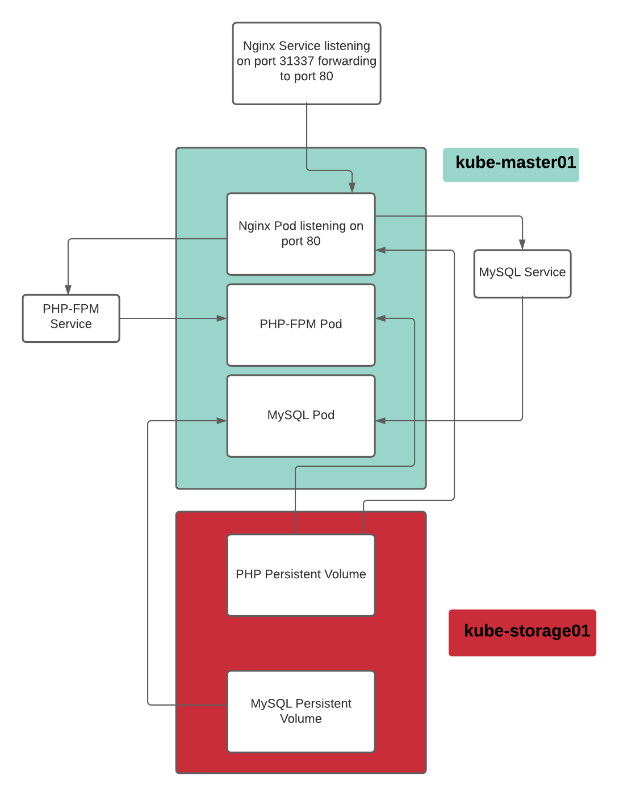

# Single Pod Application
  
The title is a bit misleading. We will be deploying the LEMP stack, but Nginx will get deployed into a single Pod on a single Node, MySQL will be deployed in a second separate Pod, and PHP-FPM will be deployed in a third separate pod. We will be creating the Pods within Deployments so that should the Pod crash for any reason, Kubernetes will recreate it.
  
**Here is a Diagram:**
 
  
**Create the `apps/single_pod` directory:**
```
mkdir -p ~/apps/single_pod
```
**Create the `01-mysql-pv.yaml` file:**
```
vim ~/apps/single_pod/01-mysql-pv.yaml
```

**With the following content:**
```
apiVersion: v1
kind: PersistentVolume
metadata:
  name: mysql-pv-volume
  labels:
    type: local
spec:
  storageClassName: manual
  capacity:
    storage: 5Gi
  accessModes:
    - ReadWriteOnce
  hostPath:
    path: "/mnt/data"
---
apiVersion: v1
kind: PersistentVolumeClaim
metadata:
  name: mysql-pv-claim
spec:
  storageClassName: manual
  accessModes:
    - ReadWriteOnce
  resources:
    requests:
      storage: 5Gi
```
  
**Create the MySQL Volume with:**
```
kubectl apply -f ~/apps/single_pod/01-mysql-pv.yaml
```

**Create the `02-mysql-deployment.yaml` file:**
```
vim ~/apps/single_pod/02-mysql-deployment.yaml
```

**With the following content:**
```
apiVersion: v1
kind: Service
metadata:
  name: mysql
spec:
  ports:
  - port: 3306
  selector:
    app: mysql
---
apiVersion: apps/v1
kind: Deployment
metadata:
  name: mysql
spec:
  selector:
    matchLabels:
      app: mysql
  strategy:
    type: Recreate
  template:
    metadata:
      labels:
        app: mysql
    spec:
      containers:
      - image: mysql:5.6
        name: mysql
        env:
          # Use secret in real usage
        - name: MYSQL_ROOT_PASSWORD
          value: password123
        ports:
        - containerPort: 3306
          name: mysql
        volumeMounts:
        - name: mysql-persistent-storage
          mountPath: /var/lib/mysql
      volumes:
      - name: mysql-persistent-storage
        persistentVolumeClaim:
          claimName: mysql-pv-claim
```
  
**Create the MySQL Service and Deployment with:**
```
kubectl apply -f ~/apps/single_pod/02-mysql-deployment.yaml
```

**Create the `03-php-service.yaml` file:**
```
vim ~/apps/single_pod/03-php-service.yaml
```

**With the following content:**
```
apiVersion: v1
kind: Service
metadata:
  name: php
  labels:
    tier: backend
spec:
  selector:
    app: php
    tier: backend
  ports:
  - protocol: TCP
    port: 9000
```
  
**Create the PHP-FPM Service:**
```
kubectl apply -f ~/apps/single_pod/03-php-service.yaml
```

**Create the `04-nginx-service.yaml` file:**
```
vim ~/apps/single_pod/04-nginx-service.yaml
```

**With the following content:**
```
apiVersion: v1
kind: Service
metadata:
  name: nginx
  labels:
    tier: backend
spec:
  selector:
    app: nginx
    tier: backend
  ports:
  - nodePort: 31337
    protocol: TCP
    port: 80
    targetPort: 80
  sessionAffinity: None
  type: NodePort
```
  
**Create the NGINX Service with:**
```
kubectl apply -f ~/apps/single_pod/04-nginx-service.yaml
```

**Create the `05-php-pvc.yaml` file:**
```
vim ~/apps/single_pod/05-php-pvc.yaml
```

**With the following content:**
```
apiVersion: v1
kind: PersistentVolumeClaim
metadata:
  name: php-pv-claim
spec:
  storageClassName: managed-nfs-storage
  accessModes:
    - ReadWriteMany
  resources:
    requests:
      storage: 2Gi
```
  
**Create the PHP-FPM Volume with:**
```
kubectl apply -f ~/apps/single_pod/05-php-pvc.yaml
```

**Create the `06-php-deployment.yaml` file:**
```
vim ~/apps/single_pod/06-php-deployment.yaml
```

**With the following content:**
```
apiVersion: apps/v1
kind: Deployment
metadata:
  name: php
  labels:
    tier: backend
spec:
  replicas: 1
  selector:
    matchLabels:     
      app: php
      tier: backend
  template:
    metadata:
      labels:
        app: php
        tier: backend
    spec:
      volumes:
      - name: php-pv-volume
        persistentVolumeClaim:
          claimName: php-pv-claim
      containers:
      - name: php
        image: php:7-fpm
        volumeMounts:
        - name: php-pv-volume
          mountPath: /code
      initContainers:
      - name: install
        image: busybox
        volumeMounts:
        - name: php-pv-volume
          mountPath: /code
        command:
        - wget
        - "-O"
        - "/code/index.php"
        - https://raw.githubusercontent.com/do-community/php-kubernetes/master/index.php
```
  
**Create the PHP-FPM Deployment with:**
```
kubectl apply -f ~/apps/single_pod/06-php-deployment.yaml
```

**Create the `07-nginx-configMap.yaml` file:**
```
vim ~/apps/single_pod/07-nginx-configMap.yaml
```

**With the following content:**
```
apiVersion: v1
kind: ConfigMap
metadata:
  name: nginx-config
  labels:
    tier: backend
data:
  config : |
    server {
      index index.php index.html;
      error_log  /var/log/nginx/error.log;
      access_log /var/log/nginx/access.log;
      root /code;

      location / {
          try_files $uri $uri/ /index.php?$query_string;
      }

      location ~ \.php$ {
          try_files $uri =404;
          fastcgi_split_path_info ^(.+\.php)(/.+)$;
          fastcgi_pass php:9000;
          fastcgi_index index.php;
          include fastcgi_params;
          fastcgi_param SCRIPT_FILENAME $document_root$fastcgi_script_name;
          fastcgi_param PATH_INFO $fastcgi_path_info;
        }
    }
```
  
**Create the NGINX ConfigMap with:**
```
kubectl apply -f ~/apps/single_pod/07-nginx-configMap.yaml
```

**Create the `08-nginx-deployment.yaml` file:**
```
vim ~/apps/single_pod/08-nginx-deployment.yaml
```

**With the following content:**
```
apiVersion: apps/v1
kind: Deployment
metadata:
  name: nginx
  labels:
    tier: backend
spec:
  replicas: 1
  selector:
    matchLabels:
      app: nginx
      tier: backend
  template:
    metadata:
      labels:
        app: nginx
        tier: backend
    spec:
      volumes:
      - name: php-pv-volume
        persistentVolumeClaim:
          claimName: php-pv-claim
      - name: config
        configMap:
          name: nginx-config
          items:
          - key: config
            path: site.conf
      containers:
      - name: nginx
        image: nginx:1.7.9
        ports:
        - containerPort: 80
        volumeMounts:
        - name: php-pv-volume
          mountPath: /code
        - name: config
          mountPath: /etc/nginx/conf.d
```
  
**Create the NGINX Deployment with:**
```
kubectl apply -f ~/apps/single_pod/08-nginx-deployment.yaml
```
  
**Make sure all the pods are running:**  
```
root@kube-master01:~# kubectl get pods
NAME                                     READY   STATUS    RESTARTS   AGE
mysql-7999994656-kvd9f                   1/1     Running   0          16m
nfs-client-provisioner-8797b57b8-xkcbw   1/1     Running   1          61d
nginx-54d7bf597b-4drrr                   1/1     Running   0          5m20s
php-55945cc458-rlxrj                     1/1     Running   0          12m
```
  
**Make sure the nginx service exists with the correct ports (80 and 31337):**
```
root@kube-master01:~# kubectl get service | grep nginx
nginx        NodePort    10.111.38.250    <none>        80:31337/TCP   83s
```
  
**Make sure your master node is listening on port 31337:**
```
root@kube-master01:~# netstat -plnt | grep 31337
tcp        0      0 0.0.0.0:31337           0.0.0.0:*               LISTEN      3116/kube-proxy
```
  
**You should now be able to bring up the website in your web broswer by visiting:**
```
http://<MASTER_NODE_IP>:31337

What you should see is a phpinfo page showing that both php-fpm and nginx are working properly
```
  
**You can also get shell access to the php container and communicate to MySQL:**
```
# kubectl exec -it php-55945cc458-rfpf2 -- /bin/sh
(replace the name of the Pod with your own, you can find it with the command 'kubectl get pods')

# apt-get update
# apt-get install -y mariadb-client-10.3
# mysql -h mysql -u root -p
```

**Note:** The root password comes from `02-mysql-deployment.yaml` and the hostname of mysql comes from the name of the Service in the same file
  
**Steps to delete the resoources you just deployed:**
```
kubectl delete deployments.apps nginx
kubectl delete configmaps nginx-config
kubectl delete deployments.apps php
kubectl delete pvc php-pv-claim
kubectl delete service nginx
kubectl delete service php
kubectl delete deployments.apps mysql
kubectl delete service mysql
kubectl delete pvc mysql-pv-claim
kubectl delete pv mysql-pv-volume
```
  
[<-- Back to Labs](../README.md)
[<-- Back to Main](../../README.md)